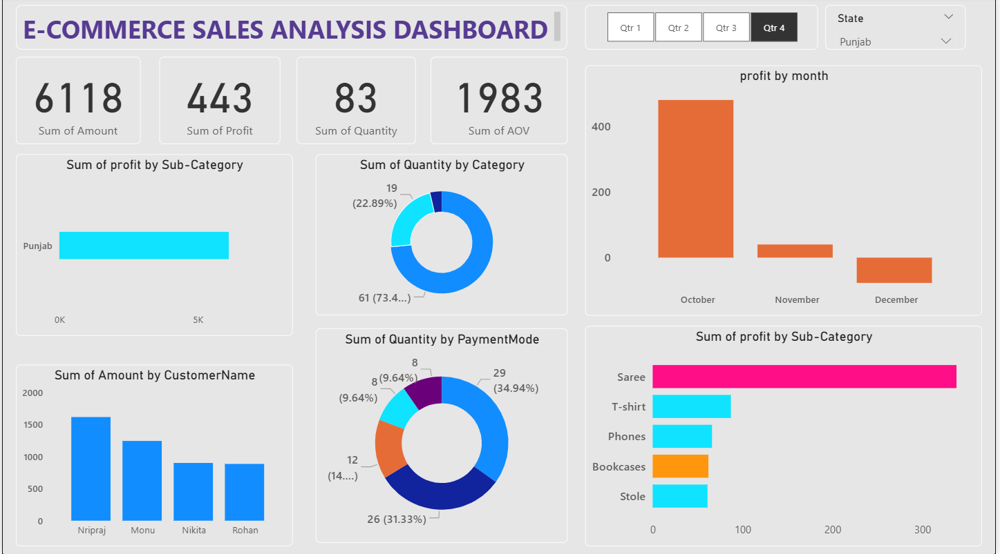

# 🛒📊E-Commerce Sales Analysis Dashboard  (Power BI)

This project showcases a professional and interactive Power BI Dashboard built using e-commerce sales data. It visualizes key metrics like total sales, profit, customer count, and monthly trends. The dashboard offers insights by category, sub-category, region, and payment mode.

## Dataset Overview

- The analysis is based on two combined CSV files:

### Orders.csv

-Contains customer order information:

-Order ID

-Order Date

-Customer Name

-State

-City

### Details.csv

- Includes transaction and sales details:

- Order ID

- Amount, Profit, Quantity

- Category, Sub-Category

- Payment Mode

## 📊 Dashboard Features

- The Power BI dashboard highlights the following metrics and visualizations:

- Total Sales, Orders, Customers, and Average Order Value

- Monthly Profit Trends

- Profit by Sub-Category & Category

- Sales by Payment Mode

- Top Customers and Order Quantities

🛠 Tools & Technologies

- Power BI Desktop

- Power Query for data transformation

- DAX for calculated measures

- CSV as the data source

💡 Skills Demonstrated

- Data modeling and table relationships

- Creating meaningful KPI (Total Sales, AOV, Quantity Sold)

- Designing an intuitive and interactive dashboard

- Data cleaning and transformation in Power BI

- Drill-through and dynamic filtering using slicers

Creating the power Bi Dashboard its not creats the visual but it also give the entire data analysis of the raw data into actionable insights.Dashboard make sure the data should be easy to understand and 
performs the right analysis on the dataset.

### 🙋‍♂️Author : Amit kumar

